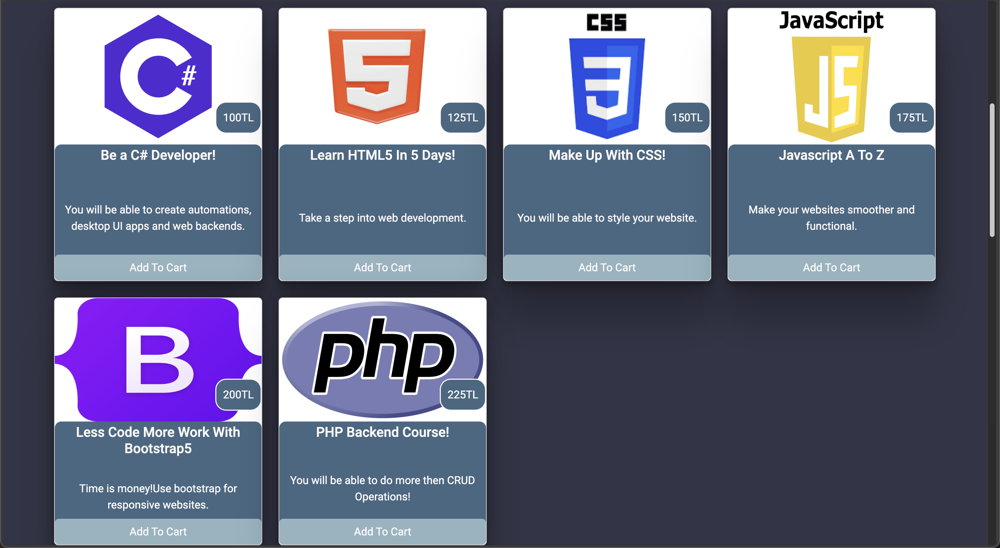

# E-Commerce Frontend Only

In this project i showed you how e-commerce projects should look.I have designed a modern e-commerce fronted example using basic technologys.


## Get the project

```bash
  git clone https://github.com/CanAran-Coder/E-Commerce-Frontend.git
```

## Technologys
- HTML
- CSS
- Bootstrap
- Javascript(vanilla)

## Screenshots




